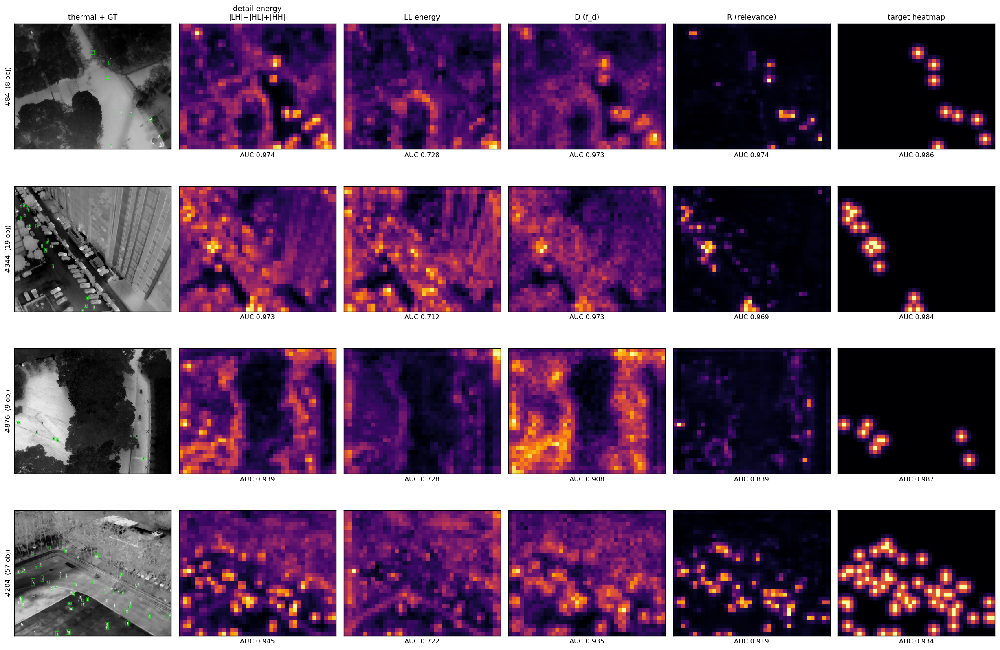
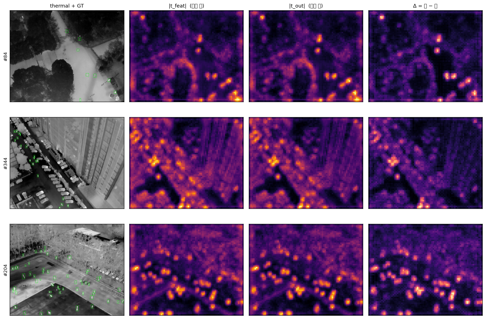

# TDS: Thermal Detail Selection for RGB-T Tiny Person Detection

This repository extends [COXNet](README_COXNet.md) (TCSVT 2026) with **TDS
(Thermal Detail Selection)** — a refinement module for the thermal branch of
the fusion stage.

## Motivation

COXNet's CLFM enhances only the **visible** feature in the wavelet domain: the
thermal feature contributes its LL band as an ingredient and then reaches
fusion untouched, while its detail bands (LH/HL/HH) are computed and discarded.
Those discarded bands are the ones aligned with the objects:

| band | object-vs-background AUC (level 0) |
|---|---|
| thermal LH / HL / HH (discarded) | 0.903 / 0.910 / 0.916 |
| visible LH / HL (used) | 0.361 / 0.368 |

A ground-truth-gated oracle on the trained baseline shows the same detail is a
tiny-object cue at object positions (+1.93 mAP50 when amplified there) and
clutter over background (−1.99 when amplified there) — so the question is not
*whether* to use thermal detail but *where*.

## Method

TDS reuses the DWT that CLFM already computes and gives the thermal branch a
symmetric, position-adaptive refinement:

```
D  = f_d([LH, HL, HH])          one description of the detail response
R  = sigmoid(f_g([LL, D]))      Detail Relevance Map: is the response object-related
g_b = s_b (1 + k_b (R − R̄))     per-band, per-position weight (all learned)
T′ = IDWT(LL, g·[LH, HL, HH])   LL untouched → structure and position preserved
```

- **R** is supervised by a Gaussian heatmap on the GT box centres with
  CenterNet-style penalty-reduced focal loss. Supervision is required: the
  detection loss reaches this gate with a gradient 100–1000× below the
  neighbouring layers, and an unsupervised gate converges to a constant.
- **LL guides**: destroying LL's spatial structure at inference collapses the
  map (AUC 0.970 → 0.879) while destroying D barely moves it.
- **Identity start**: `s = 1, k = 0` makes the module a no-op, so training
  starts exactly at the baseline and the worst case is the baseline.
- The RGB path of CLFM is unchanged, byte for byte.

<p align="center"></p>

*Raw detail energy fires on objects and clutter alike; LL supplies stable blob
context; their agreement — the learned map R — matches the supervision target
on unseen validation images.*

## Results (RGBTDronePerson, seed 0, best epoch)

| | mAP25 | mAP50 | mAP75 | tiny1 | tiny2 | tiny3 | small |
|---|---|---|---|---|---|---|---|
| COXNet (baseline) | 58.90 | 45.98 | 5.88 | 18.01 | 36.73 | 53.25 | 28.28 |
| **+ TDS** | **59.72** | **46.77** | **6.69** | **24.12** | **37.21** | **53.70** | **30.46** |

**Knockout attribution** — resetting the six scalars to identity at inference
*on the same trained checkpoint* (deterministic, no training noise):

| | mAP50 | tiny1 |
|---|---|---|
| module on | 46.77 | 24.12 |
| module erased (`s=1, k=0`) | 45.71 | 11.30 |

Erasing the module returns the network to baseline level and halves tiny1: the
gain rides in the module's forward computation, and the detector routes its
smallest-object evidence through the re-admitted thermal detail.

<p align="center"></p>

*The change TDS makes to the thermal feature lands on the objects (box AUC of
the energy difference: 0.981; object/background energy ratio 1.70 → 1.90).*

## Usage

Environment and data follow [the original COXNet instructions](README_COXNet.md).

```bash
# pre-flight (identity at init, RGB-path independence, gradient reachability)
python tools/misc/test_tds.py

# train
python tools/train.py --config configs/coxnet/coxnet_tds_r50_fpn_1x_rgbtdroneperson.py --seed 0

# evaluate
python tools/test.py --config configs/coxnet/coxnet_tds_r50_fpn_1x_rgbtdroneperson.py \
  --checkpoint work_dir/coxmamba/rgbtdroneperson/coxnet_tds/epoch_10.pth --eval bbox
```

Ablations need no extra configs:

```bash
# remove the map supervision (R dies uniform → g = s, uniform re-admission only)
--cfg-options model.tdr_loss_weight=0.0
# tighter heatmap target
--cfg-options model.tdr_hm_min_sigma=0.5
# all pyramid levels (levels 1-3 receive ~1e-4 of level 0's gradient)
--cfg-options model.tdr_levels="(0,1,2,3)"
```

The module lives in
[`mmdet/models/utils/maclfm.py`](mmdet/models/utils/maclfm.py) (evidence for
each design decision is documented there), the fusion wiring in
[`mmdet/models/utils/wavelet_process.py`](mmdet/models/utils/wavelet_process.py)
(`up_tdr`), and the heatmap supervision in
[`mmdet/models/utils/fusion_strategy.py`](mmdet/models/utils/fusion_strategy.py).

## Acknowledgements

Built on [COXNet](https://github.com/Troy-peng-0327/COXNet-release)
(Peng et al., *IEEE TCSVT* 2026) and [MMDetection 2.x](https://github.com/open-mmlab/mmdetection)
(Apache-2.0 — see [LICENSE](LICENSE)). Please cite the original COXNet paper
when using this code:

```bibtex
@article{peng2026coxnet,
  title={COXNet: Cross-Layer Fusion With Adaptive Alignment and Scale Integration for RGBT Tiny Object Detection},
  author={Peng, Peiran and Xu, Tingfa and Song, Liqiang and Zhu, Mengqi and Fang, Yuqiang and Li, Jianan},
  journal={IEEE Transactions on Circuits and Systems for Video Technology},
  year={2026},
  doi={10.1109/TCSVT.2025.3595147}
}
```
